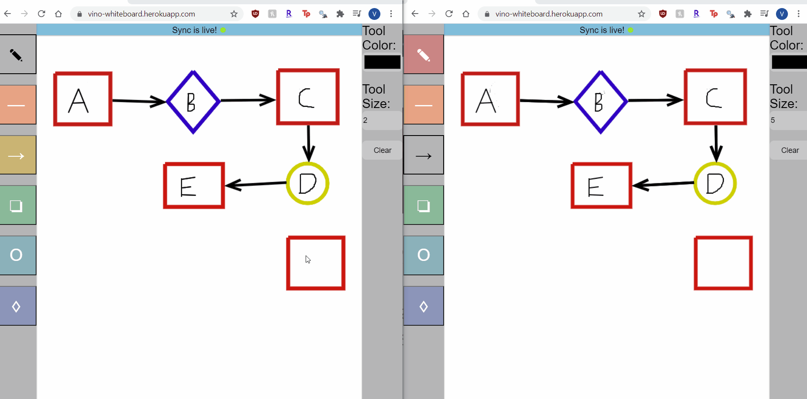

# Collaborative Whiteboard

This whiteboard app is adaptive from the tutorial from: https://www.twilio.com/blog/collaborative-whiteboard-python-flask-twilio-sync



## Installation

Clone the repo and build the environment:
```
$ git clone https://github.com/ViMan21/whiteboard
$ cd whiteboard
$ python3 -m venv venv  # use "python -m venv venv" on Windows
$ . venv/bin/activate  # use "venv\Scripts\activate" on Windows
(venv) $ pip install -r requirements.txt
```

Create a `.env` file and fill with variables in `app.py` (You will need to register a free [Twilio account](https://www.twilio.com/referral/huG0FJ)).

Run the application with:
```
(venv) $ flask run
```

Then open http://localhost:5000 on two or more tabs to test.